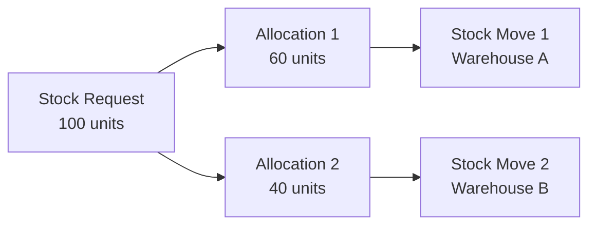

A **Stock Request Allocation** is a bridge model that links Stock Requests to Stock Moves. It tracks how much of a requested quantity is allocated to specific stock movements and monitors the fulfillment status.

## Overview

The Stock Request Allocation model (`stock.request.allocation`) serves as the connection between the request layer and the inventory movement layer in Odoo. Each allocation represents a portion of a stock request that has been assigned to a specific stock move.

<Info>
Stock Request Allocations are defined in `stock_request/models/stock_request_allocation.py:7`
</Info>

## Purpose

Allocations solve a key challenge in stock request management:

<CardGroup cols={2}>
  <Card title="Link Requests to Moves" icon="link">
    Connect high-level stock requests to low-level inventory operations
  </Card>
  <Card title="Track Fulfillment" icon="chart-line">
    Monitor how much of a request has been allocated and completed
  </Card>
  <Card title="Support Partial Fulfillment" icon="pie-chart">
    Allow requests to be fulfilled through multiple stock moves
  </Card>
  <Card title="Enable Traceability" icon="magnifying-glass">
    Trace back from stock moves to the originating requests
  </Card>
</CardGroup>

## How Allocation Works

When a stock request is confirmed, the procurement system generates one or more stock moves to fulfill it. For each move, an allocation record is created:



### Allocation Creation

Allocations are typically created during procurement:

```python
def _prepare_stock_request_allocation(self, move):
    return {
        "stock_request_id": self.id,
        "stock_move_id": move.id,
        "requested_product_uom_qty": move.product_uom_qty,
    }
```

(`stock_request.py:353`)

This method prepares the values needed to create an allocation linking a stock request to a newly created stock move.

## Key Fields

### Core Relationships

| Field | Type | Description |
|-------|------|-------------|
| `stock_request_id` | Many2one (stock.request) | The stock request being fulfilled (required) |
| `stock_move_id` | Many2one (stock.move) | The stock move fulfilling the request (required) |
| `company_id` | Many2one (res.company) | Company (inherited from stock request) |

```python
stock_request_id = fields.Many2one(
    string="Stock Request",
    comodel_name="stock.request",
    required=True,
    ondelete="cascade",
)

stock_move_id = fields.Many2one(
    string="Stock Move",
    comodel_name="stock.move",
    required=True,
    ondelete="cascade",
)
```

(`stock_request_allocation.py:11`, `stock_request_allocation.py:24`)

<Warning>
Allocations use `ondelete="cascade"`, meaning if either the stock request or stock move is deleted, the allocation is automatically removed.
</Warning>

### Product Information

| Field | Type | Description |
|-------|------|-------------|
| `product_id` | Many2one (product.product) | Product (related from stock request) |
| `product_uom_id` | Many2one (uom.uom) | Unit of measure (related from stock request) |

These fields are read-only and automatically derived from the stock request:

```python
product_id = fields.Many2one(
    string="Product",
    comodel_name="product.product",
    related="stock_request_id.product_id",
    readonly=True,
)

product_uom_id = fields.Many2one(
    string="UoM",
    comodel_name="uom.uom",
    related="stock_request_id.product_uom_id",
    readonly=True,
)
```

(`stock_request_allocation.py:30`, `stock_request_allocation.py:36`)

### Quantity Fields

Allocations track three key quantities:

#### Requested Quantity (UoM)

```python
requested_product_uom_qty = fields.Float(
    "Requested Quantity (UoM)",
    help="Quantity of the stock request allocated to the stock move, "
    "in the UoM of the Stock Request",
)
```

The quantity allocated to this move, expressed in the request's unit of measure (`stock_request_allocation.py:42`).

#### Requested Quantity (Base)

```python
requested_product_qty = fields.Float(
    "Requested Quantity",
    help="Quantity of the stock request allocated to the stock move, "
    "in the default UoM of the product",
    compute="_compute_requested_product_qty",
)

@api.depends(
    "stock_request_id.product_id",
    "stock_request_id.product_uom_id",
    "requested_product_uom_qty",
)
def _compute_requested_product_qty(self):
    for rec in self:
        rec.requested_product_qty = rec.product_uom_id._compute_quantity(
            rec.requested_product_uom_qty,
            rec.product_id.uom_id,
            rounding_method="HALF-UP",
        )
```

The same quantity converted to the product's default unit of measure (`stock_request_allocation.py:47`, `stock_request_allocation.py:64`).

#### Allocated Quantity

```python
allocated_product_qty = fields.Float(
    "Allocated Quantity",
    copy=False,
    help="Quantity of the stock request allocated to the stock move, "
    "in the default UoM of the product",
)
```

The actual quantity that has been allocated (processed) by the stock move (`stock_request_allocation.py:53`).

#### Open Quantity

```python
open_product_qty = fields.Float(
    "Open Quantity",
    compute="_compute_open_product_qty",
)

@api.depends(
    "requested_product_qty",
    "allocated_product_qty",
    "stock_move_id",
    "stock_move_id.state",
)
def _compute_open_product_qty(self):
    for rec in self:
        if rec.stock_move_id.state in ["cancel", "done"]:
            rec.open_product_qty = 0.0
        else:
            rec.open_product_qty = (
                rec.requested_product_qty - rec.allocated_product_qty
            )
            if rec.open_product_qty < 0.0:
                rec.open_product_qty = 0.0
```

The remaining quantity still to be fulfilled (`stock_request_allocation.py:59`, `stock_request_allocation.py:77`).

<Info>
Open quantity is automatically zero when the stock move is cancelled or done, regardless of allocated quantity.
</Info>

## Quantity Computation Flow

<Steps>
  <Step title="Requested Quantity Set">
    When an allocation is created, `requested_product_uom_qty` is set based on the stock move quantity.
  </Step>
  
  <Step title="Convert to Base UoM">
    The system automatically computes `requested_product_qty` in the product's default unit of measure.
  </Step>
  
  <Step title="Track Allocated Quantity">
    As the stock move progresses, `allocated_product_qty` is updated to reflect actual fulfillment.
  </Step>
  
  <Step title="Compute Open Quantity">
    The system calculates how much remains to be fulfilled:
    ```
    open_qty = requested_qty - allocated_qty (if move is not done/cancelled)
    open_qty = 0 (if move is done or cancelled)
    ```
  </Step>
</Steps>

## Use Cases

### Single Move Allocation

The simplest case: one request, one move, one allocation.

```python
# Stock Request: 100 units of Product A
request = env['stock.request'].create({
    'product_id': product_a.id,
    'product_uom_qty': 100.0,
    'location_id': location.id,
})

request.action_confirm()

# One allocation is created
allocation = request.allocation_ids[0]
print(allocation.requested_product_uom_qty)  # 100.0
print(allocation.stock_move_id.state)  # 'confirmed' or similar
print(allocation.open_product_qty)  # 100.0 (nothing fulfilled yet)
```

### Multiple Move Allocation

One request can be fulfilled by multiple moves:

```python
# Stock Request: 100 units
# Procurement creates 2 moves:
#   - 60 units from Warehouse A
#   - 40 units from Warehouse B

request = env['stock.request'].create({
    'product_id': product.id,
    'product_uom_qty': 100.0,
    'location_id': location.id,
})

request.action_confirm()

print(len(request.allocation_ids))  # 2
for allocation in request.allocation_ids:
    print(f"Move: {allocation.stock_move_id.name}")
    print(f"Requested: {allocation.requested_product_uom_qty}")
    print(f"Open: {allocation.open_product_qty}")
```

### Partial Fulfillment Tracking

Allocations enable precise tracking of partial fulfillment:

```python
allocation = request.allocation_ids[0]

print(f"Requested: {allocation.requested_product_qty}")  # 100.0
print(f"Allocated: {allocation.allocated_product_qty}")  # 0.0
print(f"Open: {allocation.open_product_qty}")  # 100.0

# After partial processing of the stock move
allocation.allocated_product_qty = 60.0

print(f"Requested: {allocation.requested_product_qty}")  # 100.0
print(f"Allocated: {allocation.allocated_product_qty}")  # 60.0
print(f"Open: {allocation.open_product_qty}")  # 40.0

# After complete processing
allocation.stock_move_id.state = 'done'
allocation.allocated_product_qty = 100.0

print(f"Open: {allocation.open_product_qty}")  # 0.0 (move is done)
```

## Integration with Stock Requests

Stock requests use allocations to compute their fulfillment status:

```python
@api.depends(
    "allocation_ids",
    "allocation_ids.stock_move_id.state",
    "allocation_ids.stock_move_id.move_line_ids",
    "allocation_ids.stock_move_id.move_line_ids.quantity",
)
def _compute_qty(self):
    for request in self:
        # ... compute done and in-progress quantities from allocations
        done_qty = abs(other_qty - incoming_qty)
        open_qty = sum(request.allocation_ids.mapped("open_product_qty"))
        # ...
```

(`stock_request.py:156`)

The request aggregates data from all its allocations to determine:
- Total quantity done
- Total quantity in progress  
- Total quantity cancelled

## Relationship to Stock Moves

Allocations provide bidirectional traceability:

```python
# From request to moves
request = env['stock.request'].browse(request_id)
moves = request.allocation_ids.mapped('stock_move_id')
print(f"Request {request.name} has {len(moves)} stock moves")

# From move to requests
move = env['stock.move'].browse(move_id)
requests = move.stock_request_allocation_ids.mapped('stock_request_id')
print(f"Move {move.name} fulfills {len(requests)} requests")
```

<Info>
A single stock move can fulfill multiple stock requests through multiple allocation records. This is useful when consolidating procurement.
</Info>

## Data Model Summary

```python
class StockRequestAllocation(models.Model):
    _name = "stock.request.allocation"
    _description = "Stock Request Allocation"

    # Links
    stock_request_id = fields.Many2one("stock.request", required=True)
    stock_move_id = fields.Many2one("stock.move", required=True)
    
    # Product info (related)
    product_id = fields.Many2one(related="stock_request_id.product_id")
    product_uom_id = fields.Many2one(related="stock_request_id.product_uom_id")
    
    # Quantities
    requested_product_uom_qty = fields.Float()  # In request UoM
    requested_product_qty = fields.Float(compute=...)  # In product UoM
    allocated_product_qty = fields.Float()  # Actual fulfillment
    open_product_qty = fields.Float(compute=...)  # Remaining
```

## Best Practices

<CardGroup cols={2}>
  <Card title="Don't Create Manually" icon="hand">
    Allocations should be created automatically through the procurement process, not manually
  </Card>
  
  <Card title="Monitor Open Quantity" icon="eye">
    Use `open_product_qty` to track fulfillment progress
  </Card>
  
  <Card title="Respect UoM Conversions" icon="scale-balanced">
    The system handles UoM conversions automatically; use the appropriate quantity field for your context
  </Card>
  
  <Card title="Cascade Awareness" icon="triangle-exclamation">
    Deleting requests or moves will cascade to allocations; ensure this is intended
  </Card>
</CardGroup>