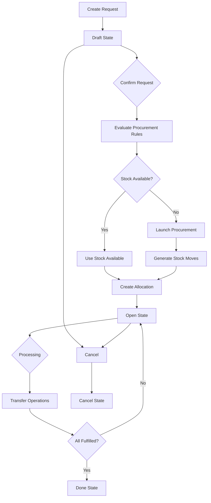

The Stock Request workflow manages the complete lifecycle of a product request, from initial creation through procurement, fulfillment, and completion or cancellation.

## Workflow Overview



## State Transitions

Stock Requests progress through four primary states during their lifecycle:

<Steps>
  <Step title="Draft → Open">
    Triggered by confirming the request (`action_confirm`). This launches procurement rules and creates stock allocations.
    
    ```python
    def _action_confirm(self):
        self._action_launch_procurement_rule()
        self.filtered(lambda x: x.state != "done").write({"state": "open"})
    ```
    (`stock_request.py:264`)
  </Step>
  
  <Step title="Open → Done">
    Automatically triggered when allocated quantities meet or exceed requested quantities.
    
    ```python
    def check_done(self):
        precision = self.env["decimal.precision"].precision_get(
            "Product Unit of Measure"
        )
        for request in self:
            allocated_qty = sum(request.allocation_ids.mapped("allocated_product_qty"))
            qty_done = request.product_id.uom_id._compute_quantity(
                allocated_qty, request.product_uom_id
            )
            if (
                float_compare(
                    qty_done, request.product_uom_qty, precision_digits=precision
                )
                >= 0
            ):
                request.action_done()
    ```
    (`stock_request.py:290`)
  </Step>
  
  <Step title="Any → Cancel">
    Manually triggered or automatically when all allocations are cancelled.
    
    ```python
    def action_cancel(self):
        self.sudo().mapped("move_ids")._action_cancel()
        self.write({"state": "cancel"})
        return True
    ```
    (`stock_request.py:276`)
  </Step>
  
  <Step title="Open/Cancel/Done → Draft">
    Manually return to draft state to modify the request.
    
    ```python
    def action_draft(self):
        self.write({"state": "draft"})
        return True
    ```
    (`stock_request.py:272`)
  </Step>
</Steps>

## Procurement Rule Evaluation

When a stock request is confirmed, the system evaluates procurement rules to determine how to fulfill the request.

### Procurement Flow

<Tabs>
  <Tab title="1. Check Conditions">
    The system first checks if procurement should be skipped:
    
    ```python
    def _skip_procurement(self):
        return self.state != "draft" or self.product_id.type not in ("consu", "product")
    ```
    
    Procurement is only launched for:
    - Requests in **draft** state
    - **Storable products** or **consumables**
    
    (`stock_request.py:337`)
  </Tab>
  
  <Tab title="2. Check Existing Moves">
    Verify if sufficient stock moves already exist:
    
    ```python
    qty = 0.0
    for move in request.move_ids.filtered(lambda r: r.state != "cancel"):
        qty += move.product_qty
    
    if float_compare(qty, request.product_qty, precision_digits=precision) >= 0:
        continue
    ```
    
    If existing moves cover the requested quantity, skip procurement.
    
    (`stock_request.py:396`)
  </Tab>
  
  <Tab title="3. Check Available Stock">
    Optionally check if stock is available at the location:
    
    ```python
    if request.company_id.stock_request_check_available_first:
        if (
            float_compare(
                request.product_id.sudo()
                .with_context(location=request.location_id.id)
                .free_qty,
                request.product_uom_qty,
                precision_digits=precision,
            )
            >= 0
        ):
            request._action_use_stock_available()
            continue
    ```
    
    If sufficient stock exists, use it directly without procurement.
    
    (`stock_request.py:404`)
  </Tab>
  
  <Tab title="4. Launch Procurement">
    Create and run procurement group:
    
    ```python
    values = request._prepare_procurement_values(
        group_id=request.procurement_group_id
    )
    procurements = []
    procurements.append(
        self.env["procurement.group"].Procurement(
            request.product_id,
            request.product_uom_qty,
            request.product_uom_id,
            request.location_id,
            request.name,
            request.name,
            self.env.company,
            values,
        )
    )
    self.env["procurement.group"].run(procurements)
    ```
    
    This triggers the procurement engine which will:
    - Evaluate routes and rules
    - Generate appropriate actions (moves, purchase orders, manufacturing orders)
    
    (`stock_request.py:418`)
  </Tab>
</Tabs>

### Procurement Values

The system prepares specific values for procurement:

```python
def _prepare_procurement_values(self, group_id=False):
    """
    Prepare specific key for moves or other components that
    will be created from a procurement rule coming from a
    stock request.
    """
    return {
        "date_planned": self.expected_date,
        "warehouse_id": self.warehouse_id,
        "stock_request_allocation_ids": self.id,
        "group_id": group_id or self.procurement_group_id.id or False,
        "route_ids": self.route_id,
        "stock_request_id": self.id,
    }
```

(`stock_request.py:321`)

<Info>
These values are passed to procurement rules and can be extended through inheritance to add custom fields.
</Info>

## Transfer Generation

Procurement rules generate stock moves which are grouped into transfer operations (pickings).

### Stock Move Creation

When using available stock, the system creates moves directly:

```python
def _action_use_stock_available(self):
    """Create a stock move with the necessary data and mark it as done."""
    allocation_model = self.env["stock.request.allocation"]
    stock_move_model = self.env["stock.move"].sudo()
    precision = self.env["decimal.precision"].precision_get(
        "Product Unit of Measure"
    )
    quants = self.env["stock.quant"]._gather(self.product_id, self.location_id)
    pending_qty = self.product_uom_qty
    for quant in quants.filtered(lambda x: x.available_quantity >= 0):
        qty_move = min(pending_qty, quant.available_quantity)
        if float_compare(qty_move, 0, precision_digits=precision) > 0:
            move = stock_move_model.create(self._prepare_stock_move(qty_move))
            move._action_confirm()
            pending_qty -= qty_move
            # Create allocation + done move
            allocation_model.create(self._prepare_stock_request_allocation(move))
            move.quantity = move.product_uom_qty
            move.picked = True
            move._action_done()
```

(`stock_request.py:360`)

### Allocation Creation

Allocations link stock requests to stock moves:

```python
def _prepare_stock_request_allocation(self, move):
    return {
        "stock_request_id": self.id,
        "stock_move_id": move.id,
        "requested_product_uom_qty": move.product_uom_qty,
    }
```

(`stock_request.py:353`)

### Tracking Pickings

The system computes associated pickings from allocations:

```python
@api.depends(
    "allocation_ids",
    "allocation_ids.stock_move_id",
    "allocation_ids.stock_move_id.picking_id",
)
def _compute_picking_ids(self):
    for request in self:
        request.picking_count = 0
        request.picking_ids = self.env["stock.picking"]
        request.picking_ids = request.move_ids.filtered(
            lambda m: m.state != "cancel"
        ).mapped("picking_id")
        request.picking_count = len(request.picking_ids)
```

(`stock_request.py:142`)

## Quantity Tracking

The system tracks three key quantities throughout the workflow:

<CardGroup cols={3}>
  <Card title="In Progress" icon="spinner">
    Quantity currently being processed (open stock moves)
  </Card>
  <Card title="Done" icon="check">
    Quantity successfully fulfilled and received
  </Card>
  <Card title="Cancelled" icon="xmark">
    Quantity that was cancelled and won't be fulfilled
  </Card>
</CardGroup>

```python
@api.depends(
    "allocation_ids",
    "allocation_ids.stock_move_id.state",
    "allocation_ids.stock_move_id.move_line_ids",
    "allocation_ids.stock_move_id.move_line_ids.quantity",
)
def _compute_qty(self):
    for request in self:
        incoming_qty = 0.0
        other_qty = 0.0
        for allocation in request.allocation_ids:
            if allocation.stock_move_id.picking_code == "incoming":
                incoming_qty += allocation.allocated_product_qty
            else:
                other_qty += allocation.allocated_product_qty
        done_qty = abs(other_qty - incoming_qty)
        open_qty = sum(request.allocation_ids.mapped("open_product_qty"))
        uom = request.product_id.uom_id
        request.qty_done = uom._compute_quantity(
            done_qty,
            request.product_uom_id,
            rounding_method="HALF-UP",
        )
        request.qty_in_progress = uom._compute_quantity(
            open_qty,
            request.product_uom_id,
            rounding_method="HALF-UP",
        )
        request.qty_cancelled = (
            max(
                0,
                uom._compute_quantity(
                    request.product_qty - done_qty - open_qty,
                    request.product_uom_id,
                    rounding_method="HALF-UP",
                ),
            )
            if request.allocation_ids
            else 0
        )
```

(`stock_request.py:156`)

## Cancellation Behavior

Cancelling a stock request has cascading effects:

<Steps>
  <Step title="Cancel Request">
    User triggers `action_cancel()` or system auto-cancels when appropriate.
  </Step>
  
  <Step title="Cancel Moves">
    All associated stock moves are cancelled:
    ```python
    self.sudo().mapped("move_ids")._action_cancel()
    ```
  </Step>
  
  <Step title="Update State">
    Request state is set to "cancel":
    ```python
    self.write({"state": "cancel"})
    ```
  </Step>
  
  <Step title="Compute Quantities">
    Cancelled quantities are computed based on unfulfilled allocations.
  </Step>
</Steps>

### Auto-Cancellation

Requests are automatically cancelled under certain conditions:

```python
def check_cancel(self):
    for request in self:
        if request._check_cancel_allocation():
            request.write({"state": "cancel"})

def _check_cancel_allocation(self):
    precision = self.env["decimal.precision"].precision_get(
        "Product Unit of Measure"
    )
    self.ensure_one()
    return (
        self.allocation_ids
        and float_compare(self.qty_cancelled, 0, precision_digits=precision) > 0
    )
```

(`stock_request.py:285`, `stock_request.py:311`)

<Warning>
If allocations exist but there's cancelled quantity with no progress, the request is automatically cancelled.
</Warning>

## Complete Workflow Example

Here's a complete example demonstrating the workflow:

```python
# 1. Create a stock request
request = env['stock.request'].create({
    'product_id': product.id,
    'product_uom_id': product.uom_id.id,
    'product_uom_qty': 100.0,
    'warehouse_id': warehouse.id,
    'location_id': location.id,
    'expected_date': fields.Datetime.now(),
})

print(request.state)  # 'draft'

# 2. Confirm the request
request.action_confirm()
print(request.state)  # 'open'

# 3. Procurement rules are evaluated
# - System checks if stock is available
# - If not, procurement rules generate stock moves or purchase orders
# - Allocations are created linking request to moves

print(len(request.allocation_ids))  # > 0
print(len(request.move_ids))  # > 0
print(len(request.picking_ids))  # > 0

# 4. Track progress
print(request.qty_in_progress)  # Quantity being processed
print(request.qty_done)  # Quantity completed

# 5. Process transfers
# Users process the pickings in the warehouse
for picking in request.picking_ids:
    picking.action_confirm()
    picking.action_assign()
    # ... process the picking

# 6. Request automatically moves to done when fulfilled
request.check_done()
print(request.state)  # 'done'
```

## Order Workflow

When working with Stock Request Orders, the workflow extends to manage multiple requests:

```python
# Create order with multiple requests
order = env['stock.request.order'].create({
    'expected_date': fields.Datetime.now(),
    'warehouse_id': warehouse.id,
    'location_id': location.id,
})

# Add multiple requests
for product in products:
    env['stock.request'].create({
        'order_id': order.id,
        'product_id': product.id,
        'product_uom_id': product.uom_id.id,
        'product_uom_qty': 10.0,
    })

# Confirm all requests at once
order.action_confirm()

# Order state is computed from child requests
print(order.state)  # 'open', 'done', 'cancel', or 'draft'
```

<Info>
The order state automatically reflects the collective state of all child requests, transitioning to "done" when all children are done or cancelled.
</Info>