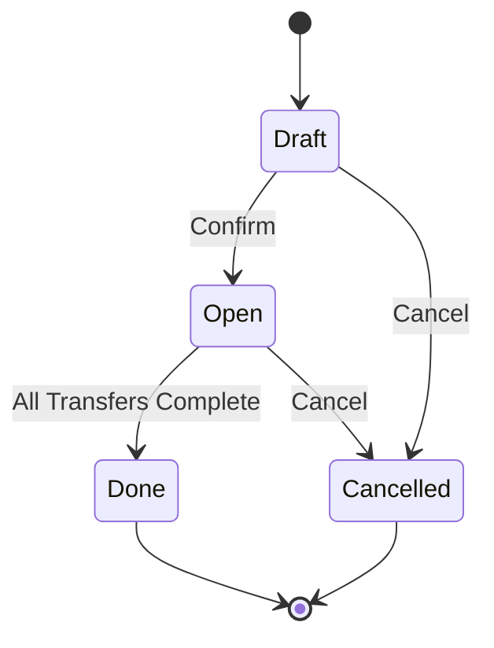

The Stock Request module enables users to request products that are frequently stocked by the company to be transferred to their chosen location. It provides a structured workflow for managing internal stock requests within your warehouse operations.

## What Problem Does It Solve?

In many organizations, employees need to request stock transfers to specific locations, but standard Odoo inventory operations require warehouse manager intervention for every transfer. The Stock Request module solves this by:

- **Decentralizing stock requests** - Users can create their own requests without direct warehouse access
- **Automating procurement** - Requests automatically trigger procurement rules based on the destination location
- **Tracking request lifecycle** - From draft to completion, with full visibility into transfer status
- **Enforcing permissions** - Role-based access ensures users only manage their own requests (unless they're managers)

## Key Benefits

<CardGroup cols={2}>
  <Card title="User Autonomy" icon="user">
    Employees can request stock transfers without requiring warehouse manager privileges
  </Card>
  
  <Card title="Automatic Procurement" icon="gears">
    Requests automatically evaluate procurement rules for the selected location
  </Card>
  
  <Card title="Full Traceability" icon="list-check">
    Track requests from creation through confirmation to transfer completion
  </Card>
  
  <Card title="Permission Control" icon="shield">
    Two-tier permission system: Users manage their own requests, Managers oversee all
  </Card>
</CardGroup>

## High-Level Architecture

The Stock Request framework consists of several core components:

### Core Models

- **Stock Request** (`stock.request`) - Individual stock requests for specific products
- **Stock Request Order** (`stock.request.order`) - Groups multiple requests together (optional)
- **Stock Request Allocation** (`stock.request.allocation`) - Links requests to stock moves
- **Procurement Integration** - Automatic procurement rule evaluation on confirmation

### Request Lifecycle

<Note>
The module inherits from `mail.thread` and `mail.activity.mixin`, providing full email notification and activity tracking capabilities.
</Note>

### State Definitions

- **Draft** - Request is being prepared, can be modified
- **Open (In Progress)** - Request confirmed, procurement triggered, transfers may be in progress
- **Done** - All requested quantities have been transferred
- **Cancelled** - Request cancelled, pending stock moves also cancelled

## Integration Points

### Stock Operations

When a stock request is confirmed:

1. The system evaluates procurement rules for the destination location
2. Stock moves are created based on available routes
3. Transfers (pickings) are generated according to procurement rules
4. Users can track transfer progress from the stock request

### Optional Modules

The base module can be extended with:

- **stock_request_purchase** - Create purchase orders from stock requests
- **stock_request_mrp** - Trigger manufacturing orders from stock requests
- **stock_request_kanban** - Kanban workflow integration
- **stock_request_bom** - Bill of Materials integration
- **stock_request_tier_validation** - Multi-tier approval workflows

## Next Steps

<CardGroup cols={2}>
  <Card title="Installation" icon="download" href="/installation">
    Learn how to install and set up the Stock Request module
  </Card>
  
  <Card title="Configuration" icon="gear" href="/configuration">
    Configure user permissions and module settings
  </Card>
  
  <Card title="Quick Start" icon="rocket" href="/quickstart">
    Create your first stock request in minutes
  </Card>
  
  <Card title="API Reference" icon="code" href="/api/stock-request">
    Explore the complete API documentation
  </Card>
</CardGroup>

## License

This module is licensed under **LGPL-3.0** and is maintained by ForgeFlow and the Odoo Community Association (OCA).

<Tip>
The Stock Request module is part of the [OCA stock-logistics-request](https://github.com/OCA/stock-logistics-request) project on GitHub. Contributions are welcome!
</Tip>