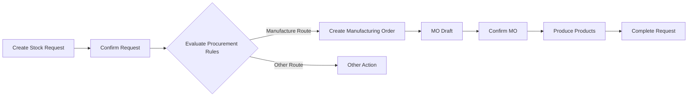

The `stock_request_mrp` module integrates stock requests with the manufacturing system, enabling users to track and manage manufacturing orders that are automatically created from confirmed stock requests.

## Overview

**Module Name**: `stock_request_mrp`  
**Version**: 18.0.1.0.0  
**License**: LGPL-3  
**Dependencies**: `stock_request`, `mrp`  
**Author**: ForgeFlow, OCA  
**Maintainers**: [@LoisRForgeFlow](https://github.com/LoisRForgeFlow), [@etobella](https://github.com/etobella)  
**Auto Install**: Yes (when both dependencies are met)

<Info>
This module enables visibility into manufacturing orders created as a consequence of stock requests, providing seamless integration between internal requests and production operations.
</Info>

## Key Features

### Manufacturing Order Visibility

- View manufacturing orders generated from stock requests
- Smart button showing MO count on request form
- Direct navigation from request to related MOs
- Track MO status from stock request interface

### Automatic Integration

- MOs created automatically via procurement rules
- Stock request origin tracked on manufacturing orders
- Bidirectional reference between requests and MOs
- Updates propagate between requests and production

### Order-Level Tracking

- View all MOs from stock request orders
- Consolidated manufacturing information
- Track multiple requests fulfilled by same MO
- Production planning based on requests

### Post-Install Hook

- Automatic configuration during installation
- Links existing manufacturing orders to stock requests
- Ensures data consistency

## Installation

<Note>
This module installs automatically when both `stock_request` and `mrp` modules are installed.
</Note>

<Steps>
  <Step title="Install Prerequisites">
    Ensure these modules are installed:
    - `stock_request` (Stock Request)
    - `mrp` (Manufacturing)
  </Step>
  
  <Step title="Automatic Installation">
    The module installs automatically due to `auto_install: True` setting.
  </Step>
  
  <Step title="Post-Install Configuration">
    The `post_init_hook` runs automatically to link existing data.
  </Step>
  
  <Step title="Verify Installation">
    Check that manufacturing order smart buttons appear on stock request forms.
  </Step>
</Steps>

## Configuration

### Product Configuration for Manufacturing

For stock requests to generate manufacturing orders:

<Steps>
  <Step title="Configure Product">
    Go to **Inventory > Products > Products** and select a product.
    
    In the **Inventory** tab:
    - Check **Can be Manufactured**
    - Add **Manufacture** route
  </Step>
  
  <Step title="Create Bill of Materials">
    Go to **Manufacturing > Products > Bills of Materials**.
    
    Click **Create** and configure:
    - **Product**: Select the manufactured product
    - **Components**: Add component products with quantities
    - **Operations**: Define manufacturing steps (optional)
    - **BoM Type**: Manufacture this product
  </Step>
  
  <Step title="Configure Routes">
    Ensure the **Manufacture** route applies to relevant locations:
    - Go to **Inventory > Configuration > Routes**
    - Verify manufacture rule for destination locations
  </Step>
</Steps>

### Warehouse Configuration

Ensure warehouse is configured for manufacturing:

```
Inventory > Configuration > Warehouses
└── Select Warehouse
    ├── Manufacture: Enabled
    └── Manufacturing Steps: 1, 2, or 3 steps
```

## Usage

### Creating Request that Triggers Manufacturing

<Steps>
  <Step title="Create Stock Request">
    Go to **Stock Requests > Stock Requests** and click **Create**.
    
    Fill in:
    - **Product**: Select a manufacturable product with BoM
    - **Quantity**: Amount needed
    - **Location**: Destination location
    - **Expected Date**: When products are needed
  </Step>
  
  <Step title="Confirm Request">
    Click **Confirm**. The system evaluates procurement rules.
  </Step>
  
  <Step title="View Created MO">
    If procurement triggers manufacturing:
    - Smart button **Manufacturing Orders** appears
    - Shows count of related MOs
    - Click to view manufacturing order(s)
  </Step>
  
  <Step title="Track MO Status">
    Monitor manufacturing order progress:
    - View MO state (Draft, Confirmed, In Progress, Done)
    - Check production status
    - Track when products finished
  </Step>
</Steps>

### Viewing Related Manufacturing Orders

#### From Stock Request

1. Open a stock request
2. Click the **Manufacturing Orders** smart button (shows count)
3. View list of related MOs
4. Click any MO to see production details

#### From Stock Request Order

1. Open a stock request order
2. Click **Manufacturing Orders** smart button
3. See all MOs generated from any request in the order
4. Access consolidated production information

### Managing Manufacturing Order Lifecycle

<Accordion title="Draft MO Created">
When stock request confirmed:
- MO created in draft state
- Contains finished product from request
- Components listed based on BoM
- Origin references stock request
- Can be edited before confirmation
</Accordion>

<Accordion title="MO Confirmed">
Production manager confirms MO:
- Components reserved
- Work orders created (if routing configured)
- Production scheduled
- Stock request tracks MO status
</Accordion>

<Accordion title="Production In Progress">
During manufacturing:
- Work orders completed
- Components consumed
- Finished products recorded
- Stock request quantities update
</Accordion>

<Accordion title="MO Completed">
When production finished:
- Finished products moved to stock
- Stock moves complete
- Stock request done when fully manufactured
</Accordion>

## Data Models

### Stock Request (Extended)

Adds manufacturing order relationship:

```python
class StockRequest(models.Model):
    _inherit = 'stock.request'
    
    mrp_production_ids = fields.One2many(
        'mrp.production',
        inverse_name='stock_request_id',
        string='Manufacturing Orders',
        readonly=True
    )
    
    mrp_count = fields.Integer(
        compute='_compute_mrp_production_ids',
        string='Manufacturing Order Count'
    )
```

### MRP Production (Extended)

Tracks originating stock request:

```python
class MrpProduction(models.Model):
    _inherit = 'mrp.production'
    
    stock_request_id = fields.Many2one(
        'stock.request',
        string='Stock Request',
        readonly=True
    )
    
    stock_request_ids = fields.Many2many(
        'stock.request',
        compute='_compute_stock_request_ids',
        string='Stock Requests'
    )
```

### Stock Request Order (Extended)

Adds order-level manufacturing tracking:

```python
class StockRequestOrder(models.Model):
    _inherit = 'stock.request.order'
    
    mrp_production_ids = fields.Many2many(
        'mrp.production',
        compute='_compute_mrp_production_ids',
        string='Manufacturing Orders'
    )
    
    mrp_count = fields.Integer(
        compute='_compute_mrp_production_ids'
    )
```

## Views

### Stock Request Form View

Enhanced with:

```xml
<!-- Smart button for manufacturing orders -->
<button name="action_view_mrp_productions"
        type="object"
        class="oe_stat_button"
        icon="fa-gears"
        attrs="{'invisible': [('mrp_count', '=', 0)]}">
    <field name="mrp_count" widget="statinfo" 
           string="Manufacturing Orders"/>
</button>
```

### Manufacturing Order Form View

Enhanced with:

- Stock request reference on production order
- Origin field shows stock request name
- Smart button to view related stock requests
- Link back to originating request

## Procurement Flow

### Request to Manufacturing Flow



### Technical Flow

<Steps>
  <Step title="Request Confirmation">
    User confirms stock request
    ```python
    stock_request.action_confirm()
    ```
  </Step>
  
  <Step title="Procurement Group">
    Procurement group created and linked
    ```python
    procurement_group = env['procurement.group'].create({
        'name': stock_request.name,
        'stock_request_id': stock_request.id,
    })
    ```
  </Step>
  
  <Step title="Run Procurement">
    Procurement engine evaluates rules
    ```python
    env['procurement.group'].run([
        Procurement(
            product_id,
            product_qty,
            product_uom,
            location_id,
            ...
        )
    ])
    ```
  </Step>
  
  <Step title="MO Creation">
    Manufacture rule triggers MO creation
    ```python
    production = env['mrp.production'].create({
        'product_id': product.id,
        'product_qty': qty,
        'bom_id': bom.id,
        'stock_request_id': stock_request.id,
        'origin': stock_request.name,
        ...
    })
    ```
  </Step>
</Steps>

## Integration with BoM Module

When used with `stock_request_bom`:

<Info>
The BoM module allows you to auto-fill stock request lines based on a Bill of Materials, which can then trigger multiple manufacturing orders.
</Info>

### Combined Workflow

<Steps>
  <Step title="Select Product BoM">
    In stock request order, select product BoM and quantity.
  </Step>
  
  <Step title="Auto-Fill Components">
    System fills request lines with all BoM components.
  </Step>
  
  <Step title="Confirm Order">
    Confirmation triggers manufacturing for finished product and procurement for components.
  </Step>
  
  <Step title="Track Production">
    Monitor all related manufacturing orders from the request order.
  </Step>
</Steps>

## Best Practices

### BoM Configuration

<Tip>
**Accurate BoMs**: Ensure Bills of Materials are accurate and up-to-date to avoid manufacturing errors.
</Tip>

<Tip>
**Component Availability**: Check component availability before confirming requests to avoid production delays.
</Tip>

### Request Planning

<Tip>
**Lead Times**: Account for manufacturing lead time when setting expected dates on stock requests.
</Tip>

<Tip>
**Batch Production**: Group similar requests to optimize production scheduling and reduce setup times.
</Tip>

### Route Configuration

<Tip>
**Make-to-Order**: Configure make-to-order route for products that should only be manufactured on demand via stock requests.
</Tip>

<Tip>
**Multi-Step Manufacturing**: Use multi-step manufacturing (pick components, manufacture, store) for better tracking.
</Tip>

## Use Cases

### Made-to-Order Production

**Scenario**: Custom or semi-custom products manufactured only when requested.

**Configuration**:
- Set Manufacture route on product
- Create BoM with required components
- Stock requests trigger manufacturing automatically

**Benefit**: No overproduction, items made exactly when needed.

### Kitting Operations

**Scenario**: Assembling kits from individual components.

**Configuration**:
- Create kit product with BoM type "Kit"
- Components listed in BoM
- Stock request for kit triggers assembly MO

**Benefit**: Track kit assembly as manufacturing operation.

### Subassembly Production

**Scenario**: Multi-level BoMs where subassemblies must be manufactured.

**Configuration**:
- Create nested BoMs (finished product > subassemblies > components)
- Stock request for finished product
- System creates MOs for subassemblies as needed

**Benefit**: Automatic cascading manufacturing orders.

## Troubleshooting

### No MO Created After Confirmation

**Problem**: Stock request confirmed but no manufacturing order generated.

**Solutions**:
1. Verify product has **Can be Manufactured** checked
2. Ensure **Manufacture** route is active on product
3. Check that a valid BoM exists for the product
4. Verify procurement rules exist for destination location
5. Review product routes apply to requested location
6. Check BoM is not archived or expired

### Wrong BoM Selected

**Problem**: MO created with unexpected BoM.

**Solutions**:
1. Check if multiple BoMs exist for the product
2. Review BoM priorities and applicability rules
3. Verify BoM company and location restrictions
4. Ensure correct BoM marked as primary

### Component Shortages

**Problem**: Cannot start production due to missing components.

**Solutions**:
1. Check component availability before confirming request
2. Use stock request orders to request components first
3. Configure safety stock for common components
4. Set up automatic component procurement

### MO Quantity Incorrect

**Problem**: Manufacturing order quantity doesn't match request.

**Solutions**:
1. Check rounding settings on product UoM
2. Review BoM quantity calculations
3. Verify no minimum/maximum lot size configured
4. Check if multiple requests consolidated into one MO

## Advanced Features

### Work Order Integration

When manufacturing uses work orders:

1. MO created with work orders from routing
2. Each operation tracked separately
3. Stock request updated as operations complete
4. Quality checks can be enforced

### Backorder Handling

When production split into backorders:

1. Original MO partially completed
2. Backorder MO created for remaining quantity
3. Both MOs linked to stock request
4. Request done only when all MOs complete

### Quality Control

Integration with quality module:

1. Quality checks defined in BoM or routing
2. Checks must pass before MO completion
3. Failed checks can block stock request fulfillment
4. Quality alerts visible from stock request

## Integration Examples

### Programmatic MO Access

```python
# Get all MOs from a stock request
stock_request = env['stock.request'].browse(request_id)
manufacturing_orders = stock_request.mrp_production_ids

for mo in manufacturing_orders:
    print(f"MO: {mo.name}, State: {mo.state}, Qty: {mo.product_qty}")
    print(f"Components: {', '.join(mo.move_raw_ids.mapped('product_id.name'))}")
```

### Finding Requests from MO

```python
# Get stock request that generated an MO
production = env['mrp.production'].browse(mo_id)
stock_request = production.stock_request_id

if stock_request:
    print(f"Request: {stock_request.name}")
    print(f"Requested by: {stock_request.requested_by.name}")
    print(f"Expected: {stock_request.expected_date}")
```

### Monitoring Production Status

```python
# Check production status for all open stock requests
open_requests = env['stock.request'].search([('state', '=', 'open')])

for request in open_requests:
    if request.mrp_production_ids:
        mo_states = request.mrp_production_ids.mapped('state')
        print(f"Request {request.name}: MO states {mo_states}")
```

## Related Modules

<CardGroup cols={2}>
  <Card title="Stock Request Core" icon="box" href="/modules/core">
    Base functionality for stock requests
  </Card>
  
  <Card title="Stock Request Purchase" icon="shopping-cart" href="/modules/purchase">
    Similar integration for purchase orders
  </Card>
  
  <Card title="Stock Request BoM" icon="list-tree" href="/modules/bom">
    Auto-fill requests based on Bill of Materials
  </Card>
  
  <Card title="Manufacturing Module" icon="book" href="https://www.odoo.com/documentation/18.0/applications/inventory_and_mrp/manufacturing.html">
    Odoo standard manufacturing documentation
  </Card>
</CardGroup>

## Performance Considerations

<Note>
The post-install hook processes existing manufacturing orders to link them with stock requests. For databases with many MOs, this may take some time during installation.
</Note>

### Optimization Tips

1. **BoM Structure**: Keep BoMs as simple as possible
2. **Component Availability**: Ensure components are available before confirming requests
3. **Batch Processing**: Group similar requests to reduce number of MOs
4. **Route Configuration**: Optimize routes to avoid unnecessary procurement steps