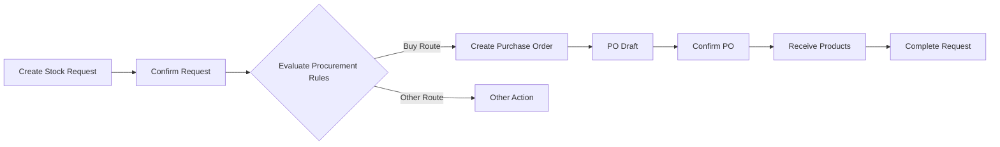

The `stock_request_purchase` module bridges stock requests with the purchasing system, allowing users to track and manage purchase orders that are automatically generated from confirmed stock requests.

## Overview

**Module Name**: `stock_request_purchase`  
**Version**: 18.0.1.0.0  
**License**: LGPL-3  
**Dependencies**: `stock_request`, `purchase_stock`  
**Author**: ForgeFlow, OCA  
**Maintainers**: [@LoisRForgeFlow](https://github.com/LoisRForgeFlow), [@etobella](https://github.com/etobella)  
**Auto Install**: Yes (when both dependencies are met)

<Info>
This module enables visibility into purchase orders created as a consequence of stock requests, providing seamless integration between internal requests and external procurement.
</Info>

## Key Features

### Purchase Order Visibility

- View purchase orders generated from stock requests
- Smart button showing PO count on request form
- Direct navigation from request to related POs
- Track PO status from stock request interface

### Automatic Integration

- POs created automatically via procurement rules
- Stock request origin tracked on purchase order lines
- Bidirectional reference between requests and POs
- Updates propagate between requests and orders

### Order-Level Tracking

- View all POs from stock request orders
- Consolidated purchase order information
- Track multiple requests fulfilled by same PO

## Installation

<Note>
This module installs automatically when both `stock_request` and `purchase_stock` modules are installed.
</Note>

<Steps>
  <Step title="Install Prerequisites">
    Ensure these modules are installed:
    - `stock_request` (Stock Request)
    - `purchase_stock` (Purchase Stock)
  </Step>
  
  <Step title="Automatic Installation">
    The module installs automatically due to `auto_install: True` setting.
  </Step>
  
  <Step title="Verify Installation">
    Check that purchase order smart buttons appear on stock request forms.
  </Step>
</Steps>

## Configuration

### Procurement Rule Setup

For stock requests to generate purchase orders, configure procurement rules:

<Steps>
  <Step title="Configure Product Routes">
    Go to **Inventory > Products > Products** and select a product.
    
    In the **Inventory** tab:
    - Check **Can be Purchased**
    - Add **Buy** route
  </Step>
  
  <Step title="Set Vendor Information">
    In the **Purchase** tab:
    - Add at least one vendor
    - Set lead time
    - Configure minimum order quantity if needed
  </Step>
  
  <Step title="Configure Location Rules">
    Go to **Inventory > Configuration > Routes** and verify:
    - Buy route has rule to trigger PO
    - Rule applies to destination location
  </Step>
</Steps>

### Warehouse Configuration

Ensure warehouse is configured for purchasing:

```
Inventory > Configuration > Warehouses
└── Select Warehouse
    ├── Incoming Shipments: 1, 2, or 3 steps
    └── Buy to Resupply: Enabled
```

## Usage

### Creating Request that Triggers Purchase

<Steps>
  <Step title="Create Stock Request">
    Go to **Stock Requests > Stock Requests** and click **Create**.
    
    Fill in:
    - **Product**: Select a purchasable product
    - **Quantity**: Amount needed
    - **Location**: Destination (must trigger buy rule)
    - **Expected Date**: When needed
  </Step>
  
  <Step title="Confirm Request">
    Click **Confirm**. The system evaluates procurement rules.
  </Step>
  
  <Step title="View Created PO">
    If procurement triggers a purchase:
    - Smart button **Purchase Orders** appears
    - Shows count of related POs
    - Click to view purchase order(s)
  </Step>
  
  <Step title="Track PO Status">
    Monitor purchase order progress:
    - View PO state (Draft, Sent, Purchase Order)
    - Check delivery status
    - Track when products received
  </Step>
</Steps>

### Viewing Related Purchase Orders

#### From Stock Request

1. Open a stock request
2. Click the **Purchase Orders** smart button (shows count)
3. View list of related POs
4. Click any PO to see details

#### From Stock Request Order

1. Open a stock request order
2. Click **Purchase Orders** smart button
3. See all POs generated from any request in the order
4. Access consolidated purchase information

### Managing Purchase Order Lifecycle

<Accordion title="Draft PO Created">
When stock request confirmed:
- PO created in draft state
- Contains line(s) for requested product(s)
- Origin references stock request
- Can be edited before confirmation
</Accordion>

<Accordion title="PO Confirmed">
Purchase manager confirms PO:
- Order sent to supplier
- Expected receipt date set
- Stock request tracks PO status
</Accordion>

<Accordion title="Products Received">
When products arrive:
- Receive products via incoming shipment
- Stock moves complete
- Stock request quantities update
- Request moves to done when fully received
</Accordion>

## Data Models

### Stock Request (Extended)

Adds purchase order relationship:

```python
class StockRequest(models.Model):
    _inherit = 'stock.request'
    
    purchase_line_ids = fields.One2many(
        'purchase.order.line',
        inverse_name='stock_request_id',
        string='Purchase Order Lines',
        readonly=True
    )
    
    purchase_order_ids = fields.Many2many(
        'purchase.order',
        compute='_compute_purchase_order_ids',
        string='Purchase Orders',
        readonly=True
    )
    
    purchase_count = fields.Integer(
        compute='_compute_purchase_order_ids',
        string='Purchase Order Count'
    )
```

### Purchase Order Line (Extended)

Tracks originating stock request:

```python
class PurchaseOrderLine(models.Model):
    _inherit = 'purchase.order.line'
    
    stock_request_id = fields.Many2one(
        'stock.request',
        string='Stock Request',
        readonly=True
    )
```

### Stock Request Order (Extended)

Adds order-level purchase tracking:

```python
class StockRequestOrder(models.Model):
    _inherit = 'stock.request.order'
    
    purchase_order_ids = fields.Many2many(
        'purchase.order',
        compute='_compute_purchase_order_ids',
        string='Purchase Orders'
    )
    
    purchase_count = fields.Integer(
        compute='_compute_purchase_order_ids'
    )
```

## Views

### Stock Request Form View

Enhanced with:

```xml
<!-- Smart button for purchase orders -->
<button name="action_view_purchase_orders"
        type="object"
        class="oe_stat_button"
        icon="fa-shopping-cart"
        attrs="{'invisible': [('purchase_count', '=', 0)]}">
    <field name="purchase_count" widget="statinfo" 
           string="Purchase Orders"/>
</button>
```

### Purchase Order Form View

Enhanced with:

- Stock request reference on order lines
- Origin field shows stock request name
- Smart button to view related stock requests

## Procurement Flow

### Request to Purchase Flow



### Technical Flow

<Steps>
  <Step title="Request Confirmation">
    User confirms stock request
    ```python
    stock_request.action_confirm()
    ```
  </Step>
  
  <Step title="Procurement Group">
    Procurement group created and linked
    ```python
    procurement_group = env['procurement.group'].create({
        'name': stock_request.name,
    })
    ```
  </Step>
  
  <Step title="Run Procurement">
    Procurement engine evaluates rules
    ```python
    env['procurement.group'].run([
        Procurement(
            product_id,
            product_qty,
            product_uom,
            location_id,
            ...
        )
    ])
    ```
  </Step>
  
  <Step title="PO Creation">
    Buy rule triggers PO creation
    ```python
    purchase_line = env['purchase.order.line'].create({
        'product_id': product.id,
        'product_qty': qty,
        'stock_request_id': stock_request.id,
        ...
    })
    ```
  </Step>
</Steps>

## Best Practices

### Vendor Configuration

<Tip>
**Multiple Vendors**: Configure multiple vendors with different lead times to optimize procurement.
</Tip>

<Tip>
**Lead Times**: Set accurate vendor lead times to ensure stock requests are fulfilled on time.
</Tip>

### Request Planning

<Tip>
**Expected Dates**: Set expected dates considering vendor lead time + internal processing time.
</Tip>

<Tip>
**Batch Requests**: Use stock request orders to group requests, potentially consolidating POs and reducing ordering costs.
</Tip>

### Route Configuration

<Tip>
**Specific Routes**: Configure location-specific routes to control when stock requests trigger purchases vs. internal transfers.
</Tip>

## Known Issues

<Warning>
**Cancellation Limitation**: When a stock request is cancelled, the quantity included in the purchase order is NOT automatically cancelled. You must manually adjust the PO.
</Warning>

### Workaround for Cancellation

When cancelling a request with open PO:

<Steps>
  <Step title="Note PO Reference">
    Before cancelling, note the related purchase order number.
  </Step>
  
  <Step title="Cancel Stock Request">
    Cancel the stock request as normal.
  </Step>
  
  <Step title="Adjust Purchase Order">
    Manually open the PO and:
    - Reduce the quantity on the line
    - Or cancel the line entirely
    - Add note explaining the change
  </Step>
</Steps>

## Troubleshooting

### No PO Created After Confirmation

**Problem**: Stock request confirmed but no purchase order generated.

**Solutions**:
1. Verify product has **Can be Purchased** checked
2. Ensure **Buy** route is active on product
3. Check vendor is configured with price
4. Verify procurement rules exist for destination location
5. Review product routes apply to requested location

### Wrong Vendor Selected

**Problem**: PO created with unintended vendor.

**Solutions**:
1. Check vendor priority/sequence in product suppliers
2. Review vendor lead times (system picks best option)
3. Ensure correct vendor marked as default

### PO Quantity Incorrect

**Problem**: Purchase order quantity doesn't match request.

**Solutions**:
1. Check minimum order quantity on vendor product
2. Review product packaging configuration
3. Verify UoM conversions between request and purchase
4. Check if multiple requests consolidated into one PO

## Integration Examples

### Programmatic PO Access

```python
# Get all POs from a stock request
stock_request = env['stock.request'].browse(request_id)
purchase_orders = stock_request.purchase_order_ids

for po in purchase_orders:
    print(f"PO: {po.name}, State: {po.state}, Total: {po.amount_total}")
```

### Finding Requests from PO

```python
# Get stock requests that generated a PO
purchase_order = env['purchase.order'].browse(po_id)
stock_requests = purchase_order.order_line.mapped('stock_request_id')

for request in stock_requests:
    print(f"Request: {request.name}, Product: {request.product_id.name}")
```

## Related Modules

<CardGroup cols={2}>
  <Card title="Stock Request Core" icon="box" href="/modules/core">
    Base functionality for stock requests
  </Card>
  
  <Card title="Stock Request MRP" icon="industry" href="/modules/mrp">
    Similar integration for manufacturing orders
  </Card>
  
  <Card title="Stock Request Submit" icon="paper-plane" href="/modules/submit">
    Add approval before PO creation
  </Card>
  
  <Card title="Purchase Module" icon="book" href="https://www.odoo.com/documentation/18.0/applications/inventory_and_mrp/purchase.html">
    Odoo standard purchasing documentation
  </Card>
</CardGroup>

## Advanced Configuration

### Multiple Warehouses

When working with multiple warehouses:

1. Configure warehouse-specific procurement rules
2. Set preferred vendors per warehouse if needed
3. Use stock request orders to group by warehouse
4. Review inter-warehouse transfers vs. direct purchase

### Dropshipping

For dropship scenarios:

1. Configure dropship route on products
2. Stock requests can trigger dropship POs
3. Products ship directly to request location
4. No incoming shipment to main warehouse

<Note>
Dropshipping requires the `stock_dropshipping` module to be installed.
</Note>