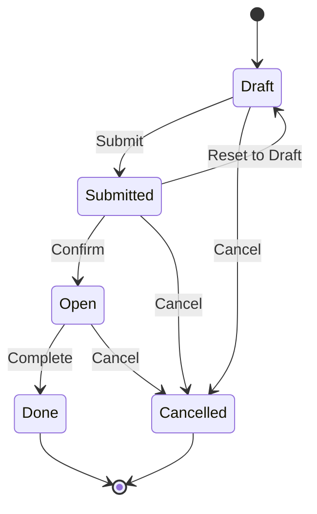

The `stock_request_submit` module adds a "Submitted" state to stock requests, enabling a supervisory review and approval step before requests are confirmed and processed.

## Overview

**Module Name**: `stock_request_submit`  
**Version**: 18.0.1.0.0  
**License**: LGPL-3  
**Dependencies**: `stock_request`  
**Author**: Open Source Integrators, OCA  
**Category**: Warehouse Management  
**Uninstall Hook**: Yes (cleanup on removal)

<Info>
This module adds a "Submitted" state between draft and confirmed, allowing supervisors to review and validate requests, and make routing corrections if needed before final confirmation.
</Info>

## Key Features

### Submitted State

- New state added to request workflow: **Submitted**
- Separates request creation from confirmation
- Allows supervisor review before processing
- Enables route correction and validation

### Two-Step Workflow

1. **User Submits**: Requester submits draft request for approval
2. **Supervisor Confirms**: Supervisor reviews, adjusts if needed, and confirms

### Route Validation

- Supervisors can verify and adjust routes before confirmation
- Prevent incorrect routing decisions
- Ensure optimal fulfillment paths
- Correct any misconfigurations

## Installation

<Steps>
  <Step title="Install Stock Request">
    Ensure `stock_request` module is installed.
  </Step>
  
  <Step title="Install Submit Module">
    Navigate to **Apps**, search for "Stock Request Submit", and click **Install**.
  </Step>
  
  <Step title="Verify Workflow">
    Create a test request and verify Submit button appears.
  </Step>
</Steps>

<Note>
The module includes an uninstall hook that cleans up the submitted state when the module is uninstalled, converting submitted requests back to draft.
</Note>

## Configuration

### User Permissions

Ensure proper permission assignment:

**Stock Request User**
- Can create and submit their own requests
- Can view their submitted requests
- Cannot confirm requests

**Stock Request Manager/Supervisor**
- Can view all submitted requests
- Can confirm submitted requests
- Can edit routes and parameters
- Can reject/reset requests to draft

### Workflow Configuration

No additional configuration required. The submitted state is automatically added to the workflow.

## Usage

### User Workflow: Submitting a Request

<Steps>
  <Step title="Create Request">
    Go to **Stock Requests > Stock Requests** and click **Create**.
    
    Fill in:
    - **Product**: Select product
    - **Quantity**: Amount needed
    - **Location**: Destination location (or use direction if enabled)
    - **Expected Date**: When needed
  </Step>
  
  <Step title="Submit for Approval">
    Click **Submit** button.
    
    Request state changes from **Draft** to **Submitted**.
  </Step>
  
  <Step title="Wait for Approval">
    Request awaits supervisor review.
    
    User can:
    - View submitted request (read-only)
    - Cancel if needed
    - Check approval status
  </Step>
</Steps>

### Supervisor Workflow: Reviewing and Confirming

<Steps>
  <Step title="View Submitted Requests">
    Go to **Stock Requests > Stock Requests**.
    
    Filter by: **State = Submitted**
  </Step>
  
  <Step title="Review Request">
    Open submitted request and review:
    - Product and quantity
    - Destination location
    - Expected date
    - Requester information
    - Current route/procurement rules
  </Step>
  
  <Step title="Validate or Adjust">
    If needed, adjust:
    - **Route**: Change procurement route
    - **Location**: Correct destination if wrong
    - **Warehouse**: Adjust source warehouse
    - **Expected Date**: Modify if unrealistic
  </Step>
  
  <Step title="Confirm or Reject">
    Choose action:
    - **Confirm**: Process the request (creates transfers/procurement)
    - **Reset to Draft**: Send back for corrections
    - **Cancel**: Reject the request entirely
  </Step>
</Steps>

### Stock Request Order Submission

The module also adds submission workflow to stock request orders:

<Steps>
  <Step title="Create Order">
    Create stock request order with multiple request lines.
  </Step>
  
  <Step title="Submit Order">
    Click **Submit** on the order.
    
    All included requests move to Submitted state.
  </Step>
  
  <Step title="Supervisor Reviews Order">
    Supervisor reviews entire order at once.
  </Step>
  
  <Step title="Confirm Order">
    Confirming order confirms all included requests.
  </Step>
</Steps>

## State Workflow

### State Diagram



### State Definitions

| State | Description | Available Actions |
|-------|-------------|-------------------|
| **Draft** | Initial state, being edited | Submit, Cancel |
| **Submitted** | Awaiting supervisor approval | Confirm, Reset to Draft, Cancel |
| **Open** | Confirmed and being fulfilled | View transfers, Cancel |
| **Done** | Fully completed | Archive |
| **Cancelled** | Cancelled by user or supervisor | Archive |

## Data Models

### Stock Request (Extended)

State selection modified:

```python
class StockRequest(models.Model):
    _inherit = 'stock.request'
    
    state = fields.Selection(
        selection_add=[
            ('submitted', 'Submitted'),
        ],
        ondelete={'submitted': 'set default'}
    )
    
    def action_submit(self):
        """Submit request for approval"""
        self.write({'state': 'submitted'})
        
    def action_confirm(self):
        """Confirm submitted request"""
        # Original confirmation logic
        super().action_confirm()
        
    def action_draft(self):
        """Reset to draft"""
        self.write({'state': 'draft'})
```

### Stock Request Order (Extended)

Order-level submission:

```python
class StockRequestOrder(models.Model):
    _inherit = 'stock.request.order'
    
    state = fields.Selection(
        selection_add=[
            ('submitted', 'Submitted'),
        ]
    )
    
    def action_submit(self):
        """Submit order and all requests"""
        self.write({'state': 'submitted'})
        self.stock_request_ids.write({'state': 'submitted'})
```

## Views

### Stock Request Form View

Enhanced with submit button:

```xml
<header>
    <!-- Submit button in draft state -->
    <button name="action_submit" 
            type="object" 
            string="Submit"
            class="oe_highlight"
            attrs="{'invisible': [('state', '!=', 'draft')]}"/>
    
    <!-- Confirm button in submitted state -->
    <button name="action_confirm" 
            type="object" 
            string="Confirm"
            class="oe_highlight"
            groups="stock_request.group_stock_request_manager"
            attrs="{'invisible': [('state', '!=', 'submitted')]}"/>
    
    <!-- Reset to draft button -->
    <button name="action_draft" 
            type="object" 
            string="Reset to Draft"
            groups="stock_request.group_stock_request_manager"
            attrs="{'invisible': [('state', 'not in', ['submitted'])]}"/>
    
    <field name="state" widget="statusbar" 
           statusbar_visible="draft,submitted,open,done"/>
</header>
```

### Stock Request Tree View

Submitted state badge:

```xml
<field name="state" 
       decoration-info="state == 'submitted'"
       decoration-success="state == 'done'"
       decoration-muted="state == 'cancel'"
       widget="badge"/>
```

## Use Cases

### Department Budget Control

**Scenario**: Department requests need supervisor approval for budget control.

<Steps>
  <Step title="Employee Creates Request">
    Employee submits request for materials.
  </Step>
  
  <Step title="Supervisor Reviews">
    Supervisor checks budget availability.
  </Step>
  
  <Step title="Approve or Reject">
    - If budget OK: Confirm request
    - If no budget: Cancel or defer
  </Step>
</Steps>

### Route Validation

**Scenario**: Ensure optimal routing before committing to procurement.

<Steps>
  <Step title="User Submits">
    User submits request, may not know optimal route.
  </Step>
  
  <Step title="Supervisor Reviews Routing">
    Supervisor verifies:
    - Product should be purchased vs transferred
    - Correct warehouse selected
    - Optimal fulfillment path
  </Step>
  
  <Step title="Adjust and Confirm">
    Supervisor adjusts route if needed, then confirms.
  </Step>
</Steps>

### Multi-Tier Organization

**Scenario**: Large organization with multiple approval levels.

**Workflow**:
1. Employee submits to team lead
2. Team lead reviews and adjusts
3. Team lead submits to department manager
4. Department manager confirms

<Note>
For complex multi-tier approval, consider using `stock_request_tier_validation` module instead.
</Note>

## Best Practices

### Clear Submission Guidelines

<Tip>
**Document Requirements**: Provide clear guidelines on what information must be included before submission.
</Tip>

<Tip>
**Expected Timeline**: Set expectations for review and approval timeframes.
</Tip>

### Supervisor Workflow

<Tip>
**Daily Review**: Establish routine for reviewing submitted requests (e.g., daily at 10am).
</Tip>

<Tip>
**Feedback Loop**: When resetting to draft, add notes explaining what needs correction.
</Tip>

### System Configuration

<Tip>
**Notifications**: Set up email notifications to supervisors when requests submitted.
</Tip>

<Tip>
**Dashboard**: Create dashboard showing pending submitted requests for quick access.
</Tip>

## Integration with Other Modules

### Stock Request Direction

Combine with directional requests:

1. User creates directional request (simplified)
2. User submits for approval
3. Supervisor reviews and sets specific locations
4. Supervisor confirms

### Stock Request Kanban

Kanban requests with submission:

1. Scan kanban card (creates draft request)
2. Batch submit multiple kanban requests
3. Supervisor reviews batch
4. Confirm all at once

### Stock Request Tier Validation

<Warning>
**Module Conflict**: Stock Request Submit and Stock Request Tier Validation provide similar but different workflows. Generally, use one or the other, not both.
</Warning>

**Comparison**:
- **Submit**: Simple two-step (submit → confirm)
- **Tier Validation**: Complex multi-tier approval workflow

**When to Use Submit**:
- Simple approval structure
- Single supervisor approval needed
- Focus on route validation

**When to Use Tier Validation**:
- Multiple approval tiers required
- Different approvers based on conditions
- Formal approval tracking needed

## Troubleshooting

### Submit Button Not Visible

**Problem**: Submit button doesn't appear on draft requests.

**Solutions**:
1. Verify module installed correctly
2. Refresh browser cache
3. Check user has stock request user permissions
4. Ensure request in draft state

### Cannot Confirm Submitted Request

**Problem**: Confirm button missing or disabled.

**Solutions**:
1. Check user has Stock Request Manager permissions
2. Verify request in submitted state
3. Review security group assignments
4. Check for other module conflicts

### Requests Stuck in Submitted

**Problem**: No supervisors reviewing submitted requests.

**Solutions**:
1. Set up email notifications for submitted requests
2. Create filtered view showing submitted requests
3. Assign dedicated supervisor role
4. Add submitted request count to dashboard

### State Confusion After Uninstall

**Problem**: Requests in unexpected state after uninstalling module.

**Solution**:
The uninstall hook should handle this, but if issues occur:

```python
# Manually reset submitted requests to draft
env['stock.request'].search([('state', '=', 'submitted')]).write({'state': 'draft'})
```

## Advanced Features

### Custom Approval Logic

Extend submission with custom validation:

```python
class StockRequest(models.Model):
    _inherit = 'stock.request'
    
    def action_submit(self):
        # Custom validation before submission
        for request in self:
            if request.product_qty > 1000:
                raise UserError(
                    "Quantities over 1000 require manager approval."
                    " Please contact your manager."
                )
        return super().action_submit()
    
    def action_confirm(self):
        # Custom checks before confirmation
        for request in self:
            if not request.route_id:
                # Auto-select optimal route
                request._auto_select_route()
        return super().action_confirm()
```

### Automated Notifications

Set up automated notifications:

```python
class StockRequest(models.Model):
    _inherit = 'stock.request'
    
    def action_submit(self):
        result = super().action_submit()
        # Notify supervisors
        self._notify_submission()
        return result
    
    def _notify_submission(self):
        supervisors = self.env.ref(
            'stock_request.group_stock_request_manager'
        ).users
        for supervisor in supervisors:
            self.message_post(
                body=f"New request submitted by {self.requested_by.name}",
                partner_ids=supervisor.partner_id.ids,
            )
```

### Dashboard Integration

Create submitted request dashboard:

```xml
<record id="stock_request_submitted_action" model="ir.actions.act_window">
    <field name="name">Pending Approvals</field>
    <field name="res_model">stock.request</field>
    <field name="view_mode">tree,form</field>
    <field name="domain">[('state', '=', 'submitted')]</field>
    <field name="context">{'search_default_group_by_requester': 1}</field>
</record>
```

## Uninstall Behavior

<Warning>
When uninstalling this module, the uninstall hook automatically converts all "Submitted" requests back to "Draft" state.
</Warning>

Uninstall process:

1. Module uninstallation initiated
2. `uninstall_hook` executes
3. All submitted requests → draft
4. Module removed
5. Workflow returns to original (draft → open)

## Related Modules

<CardGroup cols={2}>
  <Card title="Stock Request Core" icon="box" href="/modules/core">
    Base stock request functionality
  </Card>
  
  <Card title="Stock Request Tier Validation" icon="layer-group" href="/modules/tier-validation">
    Alternative: Multi-tier approval workflow
  </Card>
  
  <Card title="Stock Request Direction" icon="arrows-left-right" href="/modules/direction">
    Simplify requests with directional selection
  </Card>
</CardGroup>