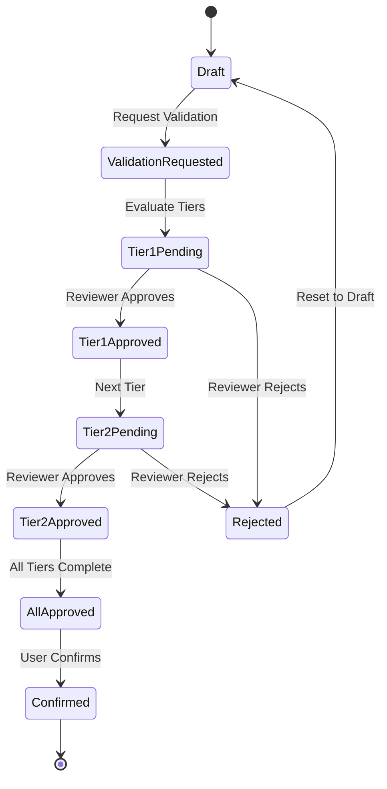

The `stock_request_tier_validation` module extends stock requests with a flexible multi-tier approval system, allowing organizations to define complex validation workflows based on various conditions.

## Overview

**Module Name**: `stock_request_tier_validation`  
**Version**: 18.0.1.0.0  
**License**: AGPL-3  
**Dependencies**: `stock_request`, `base_tier_validation`  
**Author**: ForgeFlow, OCA  
**Maintainers**: [@LoisRForgeFlow](https://github.com/LoisRForgeFlow), [@etobella](https://github.com/etobella)  
**Category**: Warehouse

<Info>
This module implements a comprehensive tier validation process for stock requests and stock request orders, enabling multi-level approvals based on configurable rules.
</Info>

## Key Features

### Multi-Tier Approval

- Define multiple validation tiers
- Each tier can have different approvers
- Sequential or parallel approval flows
- Conditional tier activation based on request attributes

### Flexible Tier Definitions

- Create tiers based on:
  - Request amount/quantity
  - Product category
  - Requester department
  - Warehouse location
  - Custom domain filters

### Review Management

- Track review status per tier
- View pending reviews
- Filter requests needing your review
- Comment and feedback on reviews

### Auto-Approval

- Users with sufficient permissions can bypass tiers
- Direct confirmation if user can validate all required tiers
- Streamlines workflow for authorized users

## Installation

<Steps>
  <Step title="Install Base Tier Validation">
    Install `base_tier_validation` from OCA/server-ux repository.
  </Step>
  
  <Step title="Install Stock Request">
    Ensure `stock_request` module is installed.
  </Step>
  
  <Step title="Install Tier Validation Module">
    Navigate to **Apps**, search for "Stock Request Tier Validation", and click **Install**.
  </Step>
  
  <Step title="Verify Installation">
    Check that tier validation tabs appear in stock request forms.
  </Step>
</Steps>

## Configuration

### Default Tier Definition

A default tier is created automatically during installation:

- **Name**: Stock Request Manager Approval
- **Model**: Stock Request
- **Reviewer**: Stock Request Manager group
- **Domain**: All stock requests

### Creating Custom Tier Definitions

<Steps>
  <Step title="Navigate to Tier Definitions">
    Go to **Settings > Technical > Tier Validations > Tier Definition**.
    
    (Requires developer mode enabled)
  </Step>
  
  <Step title="Create New Definition">
    Click **Create** and configure:
    
    - **Name**: Descriptive name for the tier
    - **Model**: Select "Stock Request" or "Stock Request Order"
    - **Sequence**: Order of evaluation (lower = first)
  </Step>
  
  <Step title="Define Reviewers">
    Choose reviewer type:
    - **Group**: All users in a group can review
    - **User**: Specific user must review
    - **Field**: User from a field on the record
    - **Python Code**: Dynamic reviewer determination
  </Step>
  
  <Step title="Set Conditions">
    Define when this tier applies:
    - **Domain**: Filter expression
    - **Python Expression**: Complex conditions
    
    Examples:
    - `[('product_qty', '>', 100)]` - Quantities over 100
    - `[('requested_by.department_id.name', '=', 'IT')]` - IT department requests
  </Step>
  
  <Step title="Configure Options">
    Set tier behavior:
    - **Approve Sequence**: Must previous tiers be approved first?
    - **Reject Sequence**: Can this tier reject directly?
    - **Comment Required**: Must reviewer add comment?
  </Step>
</Steps>

### Example Tier Configurations

#### Small Requests (Auto-Approve)

```python
Name: Team Lead Approval
Model: Stock Request
Sequence: 10
Reviewer: Team Lead group
Domain: [('product_qty', '<=', 50)]
Approve Sequence: False
```

#### Large Requests (Department Head)

```python
Name: Department Head Approval  
Model: Stock Request
Sequence: 20
Reviewer: Department Head group
Domain: [('product_qty', '>', 50), ('product_qty', '<=', 500)]
Approve Sequence: True
```

#### High-Value Requests (Manager)

```python
Name: Manager Approval
Model: Stock Request
Sequence: 30
Reviewer: Stock Request Manager group
Domain: [('product_qty', '>', 500)]
Approve Sequence: True
Comment Required: True
```

## Usage

### Requesting Approval

<Steps>
  <Step title="Create Stock Request">
    Create stock request as normal:
    - Fill in product, quantity, location, date
    - Save the request
  </Step>
  
  <Step title="Check Required Tiers">
    System evaluates tier definitions:
    - Matching tiers are identified
    - Reviews tab shows required approvals
  </Step>
  
  <Step title="Request Validation">
    Click **Request Validation** button:
    - Request state changes to validation pending
    - Reviewers are notified
    - Reviews tab shows pending approvals
  </Step>
  
  <Step title="Track Progress">
    Monitor approval progress:
    - Check **Reviews** tab for status
    - See which tiers approved/pending
    - View reviewer comments
  </Step>
  
  <Step title="Confirmation Available">
    Once all tiers validated:
    - **Confirm** button becomes available
    - Click to process the request
  </Step>
</Steps>

### Reviewing Requests

<Steps>
  <Step title="Find Pending Reviews">
    Go to **Stock Requests > Stock Requests**.
    
    Apply filter: **Needs my Review**
    
    Lists all requests awaiting your approval.
  </Step>
  
  <Step title="Open Request">
    Click on a request to review details:
    - Review product, quantity, destination
    - Check requester and justification
    - Verify routing and procurement settings
  </Step>
  
  <Step title="Navigate to Reviews Tab">
    Open the **Reviews** tab:
    - See all required tiers
    - Your pending reviews highlighted
    - View other reviewers' decisions
  </Step>
  
  <Step title="Make Decision">
    Choose action:
    - **Approve**: Click approve button for your tier
    - **Reject**: Click reject to deny request
    - **Comment**: Add explanation or feedback
  </Step>
  
  <Step title="Submit Review">
    Confirm your decision:
    - Add required comment if mandatory
    - Submit the review
    - Request progresses to next tier or completion
  </Step>
</Steps>

### Direct Confirmation (Authorized Users)

<Info>
Users who can validate all required tiers can directly confirm without requesting validation.
</Info>

<Steps>
  <Step title="Create Request">
    Authorized user creates stock request.
  </Step>
  
  <Step title="Direct Confirmation">
    Click **Confirm** button directly:
    - System checks if user can validate all tiers
    - If yes: Request confirmed immediately
    - If no: Must request validation
  </Step>
</Steps>

## Data Models

### Stock Request (Extended)

Adds tier validation fields:

```python
class StockRequest(models.Model):
    _name = 'stock.request'
    _inherit = ['stock.request', 'tier.validation']
    _state_from = ['draft']
    _state_to = ['open']
    
    # Tier validation fields (from tier.validation mixin)
    review_ids = fields.One2many(
        'tier.review',
        'res_id',
        domain=lambda self: [('model', '=', self._name)],
        string='Reviews'
    )
    
    validated = fields.Boolean(
        compute='_compute_validated_rejected',
        string='Validated'
    )
    
    need_validation = fields.Boolean(
        compute='_compute_need_validation',
        string='Need Validation'
    )
    
    reviewer_ids = fields.Many2many(
        'res.users',
        compute='_compute_reviewer_ids',
        string='Reviewers'
    )
```

### Tier Review Model

```python
class TierReview(models.Model):
    _name = 'tier.review'
    
    model = fields.Char()              # Model name
    res_id = fields.Integer()          # Record ID
    definition_id = fields.Many2one(   # Tier definition
        'tier.definition'
    )
    reviewer_id = fields.Many2one(     # Assigned reviewer
        'res.users'
    )
    status = fields.Selection([        # Review status
        ('pending', 'Pending'),
        ('approved', 'Approved'),
        ('rejected', 'Rejected'),
    ])
    comment = fields.Text()            # Reviewer comment
    review_date = fields.Datetime()    # When reviewed
```

## Views

### Stock Request Form View

Enhanced with tier validation:

```xml
<header>
    <!-- Request validation button -->
    <button name="request_validation" 
            type="object" 
            string="Request Validation"
            class="oe_highlight"
            attrs="{'invisible': ['|', 
                                  ('need_validation', '=', False),
                                  ('review_ids', '!=', [])]}"/>
    
    <!-- Confirm button (appears after validation) -->
    <button name="action_confirm" 
            type="object" 
            string="Confirm"
            class="oe_highlight"
            attrs="{'invisible': ['|',
                                  ('validated', '=', False),
                                  ('state', '!=', 'draft')]}"/>
</header>

<!-- Reviews tab -->
<page string="Reviews" 
      name="reviews"
      attrs="{'invisible': [('review_ids', '=', [])]}">
    <field name="review_ids" mode="tree">
        <tree>
            <field name="definition_id"/>
            <field name="reviewer_id"/>
            <field name="status" widget="badge"/>
            <field name="review_date"/>
            <field name="comment"/>
        </tree>
    </field>
</page>
```

### Search View with Filter

```xml
<filter name="needs_my_review" 
        string="Needs my Review"
        domain="[('reviewer_ids', 'in', uid)]"/>
```

## Tier Validation Flow

### Validation State Machine



### Approval Process

<Steps>
  <Step title="Tier Evaluation">
    System evaluates all tier definitions:
    - Checks domain conditions
    - Identifies matching tiers
    - Orders by sequence
  </Step>
  
  <Step title="Review Creation">
    Creates review records:
    - One per matching tier
    - Assigns reviewers
    - Sets to pending status
  </Step>
  
  <Step title="Sequential Approval">
    If approve sequence enabled:
    - Tier 1 must approve first
    - Then Tier 2 becomes available
    - Continues sequentially
  </Step>
  
  <Step title="Parallel Approval">
    If approve sequence disabled:
    - All tiers available simultaneously
    - Reviewers can approve in any order
    - All must approve to complete
  </Step>
  
  <Step title="Validation Complete">
    When all tiers approved:
    - `validated` field set to True
    - Confirm button becomes available
    - User can complete confirmation
  </Step>
</Steps>

## Use Cases

### Budget-Based Approvals

**Scenario**: Different approval levels based on request value.

**Configuration**:
- Tier 1: Team Lead (value < $1000)
- Tier 2: Department Head ($1000 - $5000)
- Tier 3: Finance Director (> $5000)

**Domain Examples**:
```python
# Tier 1
[('product_qty', '<=', 100)]

# Tier 2  
[('product_qty', '>', 100), ('product_qty', '<=', 500)]

# Tier 3
[('product_qty', '>', 500)]
```

### Department-Specific Workflows

**Scenario**: Different approval chains per department.

**Configuration**:
```python
# IT Department requests
Name: IT Manager Approval
Domain: [('requested_by.department_id.name', '=', 'IT')]
Reviewer: IT Manager

# Production requests
Name: Production Supervisor Approval
Domain: [('requested_by.department_id.name', '=', 'Production')]
Reviewer: Production Supervisor
```

### Product Category Validation

**Scenario**: Certain product categories need special approval.

**Configuration**:
```python
# Hazardous materials
Name: Safety Officer Approval
Domain: [('product_id.categ_id.name', '=', 'Hazardous')]
Reviewer: Safety Officer
Comment Required: True

# High-value items
Name: CFO Approval
Domain: [('product_id.categ_id.name', '=', 'Equipment')]
Reviewer: CFO
```

## Best Practices

### Tier Design

<Tip>
**Clear Sequences**: Use clear sequence numbering (10, 20, 30) to allow easy insertion of new tiers later.
</Tip>

<Tip>
**Avoid Over-Complexity**: Too many tiers slow down processes. Keep validation workflow as simple as possible.
</Tip>

<Tip>
**Test Thoroughly**: Test tier definitions with sample requests to ensure correct behavior.
</Tip>

### Domain Configuration

<Tip>
**Mutually Exclusive**: Design tier domains to avoid overlapping conditions when possible.
</Tip>

<Tip>
**Performance**: Keep domain filters simple for better performance, especially with many requests.
</Tip>

### Reviewer Assignment

<Tip>
**Group-Based**: Use groups rather than specific users for flexibility when roles change.
</Tip>

<Tip>
**Backup Reviewers**: Ensure multiple users per tier to handle absences.
</Tip>

### Communication

<Tip>
**Notifications**: Configure email notifications to alert reviewers of pending requests.
</Tip>

<Tip>
**Comment Usage**: Encourage reviewers to add comments explaining decisions, especially rejections.
</Tip>

## Advanced Configuration

### Python Expression Conditions

For complex conditions:

```python
# In tier definition, use Python Expression field:

# Check if product cost above threshold
result = record.product_id.standard_price * record.product_qty > 10000

# Check requester's manager
result = record.requested_by.parent_id.id == 5

# Business day check
from datetime import datetime
result = datetime.now().weekday() < 5  # Monday-Friday only
```

### Dynamic Reviewer Assignment

```python
# In tier definition, Reviewer Type = Python Code:

# Assign to requester's manager
result = record.requested_by.parent_id

# Assign to warehouse manager
result = record.warehouse_id.manager_id

# Assign to product category responsible
result = record.product_id.categ_id.manager_id
```

### Conditional Tier Activation

Activate tiers based on time or other factors:

```python
# Weekend requests need extra approval
from datetime import datetime
result = datetime.now().weekday() >= 5  # Saturday or Sunday

# End of month requests
from datetime import datetime
result = datetime.now().day > 25

# Urgent requests (short lead time)
result = (record.expected_date - fields.Datetime.now()).days < 2
```

## Troubleshooting

### Tier Not Triggering

**Problem**: Expected tier not appearing for a request.

**Solutions**:
1. Check domain filter matches request
2. Verify tier is active (not archived)
3. Test domain in developer console
4. Check tier model matches (stock.request vs stock.request.order)
5. Review tier sequence and prerequisites

### Cannot Confirm After Approval

**Problem**: Confirm button not appearing after all tiers approved.

**Solutions**:
1. Verify ALL tiers are approved (check Reviews tab)
2. Check user has permission to confirm
3. Ensure request in correct state (should be draft)
4. Look for validation errors in logs

### Needs My Review Filter Empty

**Problem**: Filter shows no results despite pending reviews.

**Solutions**:
1. Verify you're assigned as reviewer for relevant tiers
2. Check group membership if tier uses group reviewers
3. Refresh the view
4. Check if reviews already completed by you

### Wrong Reviewer Assigned

**Problem**: Tier assigned to unexpected reviewer.

**Solutions**:
1. Review tier definition reviewer configuration
2. Check if using field-based or Python code reviewer
3. Verify user/group data is correct
4. Test reviewer assignment logic

## Performance Considerations

<Warning>
Complex tier definitions with heavy domain filters or Python expressions can impact performance when many requests are being processed.
</Warning>

### Optimization Tips

1. **Simple Domains**: Use simple domain filters when possible
2. **Index Fields**: Ensure fields used in domains are indexed
3. **Cache Reviewers**: Use groups instead of dynamic reviewer calculation
4. **Limit Tiers**: Keep number of tiers to minimum necessary
5. **Batch Processing**: Process tier evaluations in batch when possible

## Integration Examples

### Programmatic Review Approval

```python
# Find reviews pending for current user
my_pending_reviews = env['tier.review'].search([
    ('model', '=', 'stock.request'),
    ('reviewer_id', '=', env.user.id),
    ('status', '=', 'pending'),
])

# Approve a review
review.write({
    'status': 'approved',
    'review_date': fields.Datetime.now(),
    'comment': 'Approved - within budget',
})

# Check if stock request fully validated
if stock_request.validated:
    stock_request.action_confirm()
```

### Custom Validation Logic

```python
class StockRequest(models.Model):
    _inherit = 'stock.request'
    
    def request_validation(self):
        # Custom pre-validation checks
        for request in self:
            if not request.route_id:
                raise UserError("Please select a route before requesting validation.")
        
        # Call original method
        return super().request_validation()
```

## Comparison: Submit vs Tier Validation

| Feature | Stock Request Submit | Tier Validation |
|---------|----------------------|------------------|
| **Approval Tiers** | Single (submitted → confirmed) | Multiple configurable tiers |
| **Complexity** | Simple | Advanced |
| **Conditional Logic** | No | Yes (domain-based) |
| **Review Tracking** | Basic state | Detailed per tier |
| **Use Case** | Simple approval | Complex workflows |
| **License** | LGPL-3 | AGPL-3 |

**Recommendation**: 
- Use **Submit** for simple single-approval workflows
- Use **Tier Validation** for complex multi-tier requirements

## Related Modules

<CardGroup cols={2}>
  <Card title="Stock Request Core" icon="box" href="/modules/core">
    Base stock request functionality
  </Card>
  
  <Card title="Stock Request Submit" icon="paper-plane" href="/modules/submit">
    Alternative: Simple submission workflow
  </Card>
  
  <Card title="Base Tier Validation" icon="book" href="https://github.com/OCA/server-ux">
    Core tier validation framework (OCA/server-ux)
  </Card>
</CardGroup>

## Default Tier Configuration

The module installs with this default tier:

```xml
<!-- data/stock_request_tier_definition.xml -->
<record id="tier_definition_stock_request_manager" 
        model="tier.definition">
    <field name="name">Stock Request Manager Approval</field>
    <field name="model_id" ref="stock_request.model_stock_request"/>
    <field name="review_type">group</field>
    <field name="reviewer_group_id" 
           ref="stock_request.group_stock_request_manager"/>
    <field name="sequence">10</field>
</record>
```

This ensures all requests require manager approval by default.